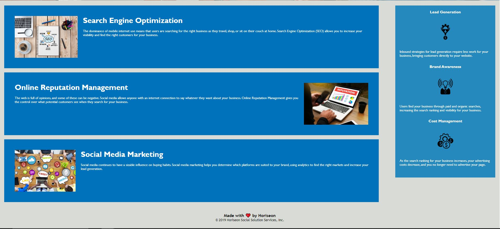

# **Urban Octo Telegram**
- This is a webpage for Horiseon and work for "Challenge 1" of my Coding Bootcamp. 

## **Description**:
- In this project I added and/or replaced certain sections of both the HTML and CSS of the [Starter Code](https://github.com/coding-boot-camp/urban-octo-telegram) given to me by the module in the BCS Bootcamp courses. I commented on each section that I had either replaced or added a semantic element. I also added "alt" attributes to images to accomplish this webpage having search engine optimization.

## **Authors/Contributors**:
- [**Scott StJohn**](https://github.com/ScottSt89)
- [**Christian Payne**](https://christianpayne.dev/) (Helpful tips and guidance)
- [**Xander Rapstine**](https://github.com/Xandromus) (Starter Code)

